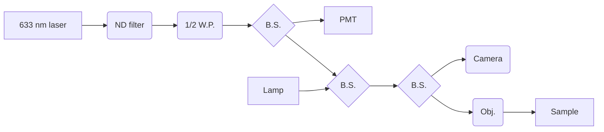

# SPCM Laboratory Notebook

Optical path:

Optical path parts:

| Item              | Part # | About |
| :---------------- | :------: | ----: |
| 633 nm laser      | PL202	| Compact Laser Module with USB Connector, 635 nm, 0.9 mW (Typ.)  |
| ND filter, 0.01\% |   NE40A   | Neutral density filter |
| 1/2 Waveplate    | WPH05ME-633 | Linear polarizer |
| Beamsplitter 1  | ...   | splits optical path to PMT |
| PMT |  PMTSS   | Standard Sensitivity PMT Module, measures refl. |
| Beamsplitter 2  |  ...   | diode |
| Beamsplitter 3  |  ...  | Neutral density filter |
| Camera tube    |  WFA4102   | Camera port 0.5x |
| Camera    |  False   | splits optical path to PMT |
| Objective |  LMM40X-P01   | 40X Reflective Objective P01 Coating 0.50 NA BFL = Infinity |

BSW04 - Ø1/2" 50:50 UVFS Plate Beamsplitter, 400-700nm, t=3mm
BSW29P - 50:50 UCFS plate beamsplitter 600-1700nm
BSS10R - 25 x 36 mm 30:70 (R:T) UVFS Plate Beamsplitter, Coating: 400 - 700 nm, t = 1 mm
BSX10 - 90:10 (R:T) UVFS Plate Beamsplitter, Coating: 400-700 nm, t = 5 mm

Starting with the "orange" flake on the PbTaSe2 chip 4. First I do a quick reflection map of a flake that is not part of the circuit to confirm the system is working.

Next I perform a reflection map of the entire flake now that I see the setup is working. 

## Experiment Identifiers

Experiments conducted for the **Scanning Photocurrent Microscope** (SPCM) are identified as follows:

_KBSX-Y_

where
- KBS is the initials of the experimentalist (Klementine Burrell-Sander)
- X is a number used to identify the molecule
- Y is a number that indicates how many times the reaction has been repeated

For example, **KBS19-3** indicates the **third** attempt at synthesising molecule **KBS19**

Experiments conducted for The Breaking Good Project are identified as follows:

Year of program
Underscore
Program the molecule is contributing to e.g. SSP (The University of Sydney's Special Studies program), BG (breaking good core program)
Underscore
One number followed by a letter - the main identifier of the molecule that is being synthesised
Underscore
A number which indicates the batch number/number of attempts

For example, **2022_BG_1J_002** describes the **second** attempt at the synthesis of molecule **1J** for the core Breaking Good program ran in **2022**.

