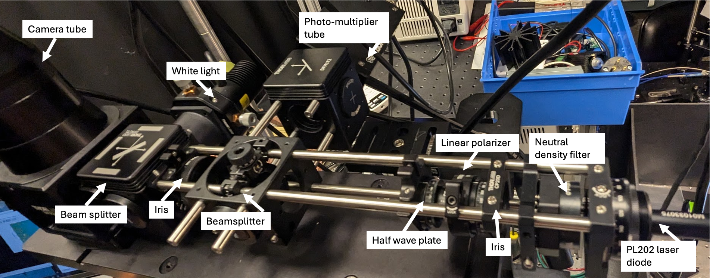
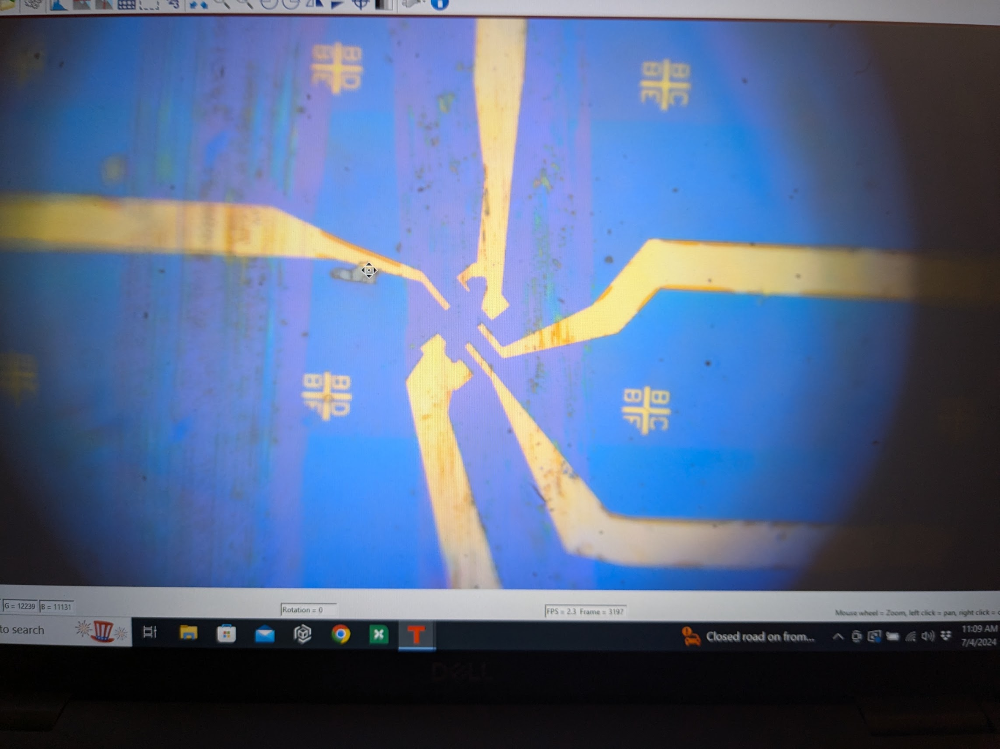
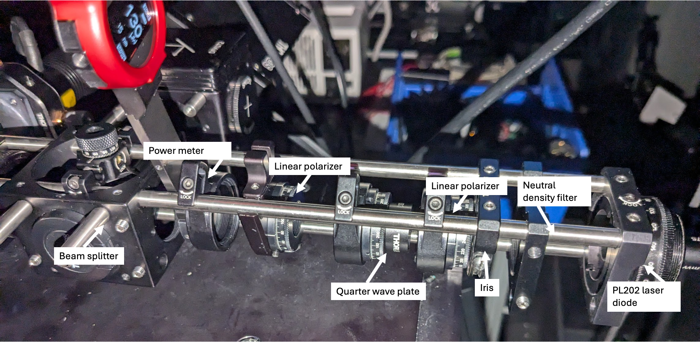
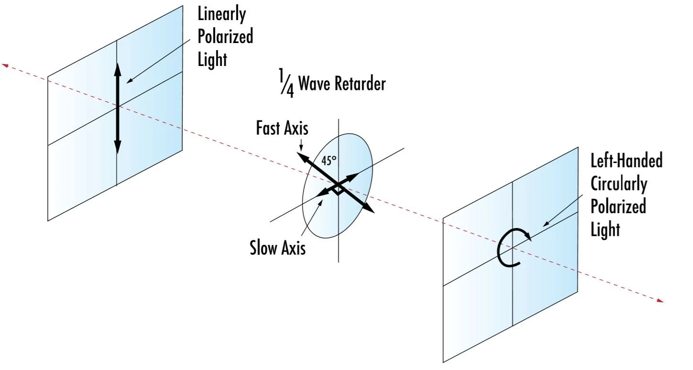
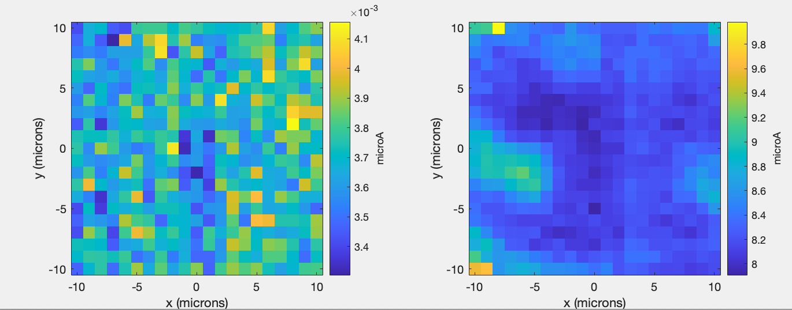
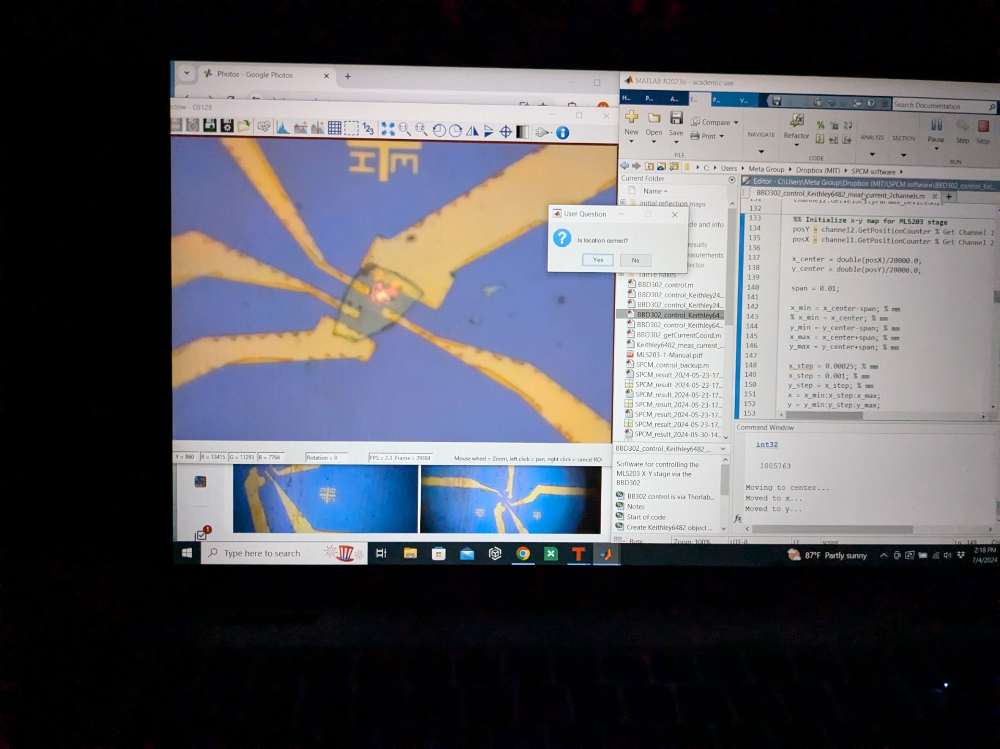
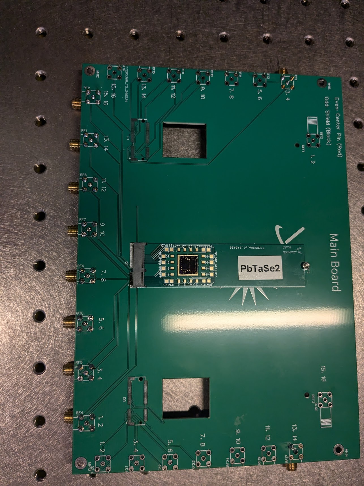

## **Summary:**

The SPCM is at a state where all the optics and electronics are working in the set up. I believe that now if we have a sample with an expected photo response, we should be able to measure it. I've been testing on a PbTaSe2 sample and do not see any photo response for either linear or circularly polarized 635nm light. I think this is to be expected.

I currently have one TaIRTe4 and two Bi2Te3 samples. These need to be wire bonded but I should be able to measure them when I return from the GRC (I'll be back July 12). Wirebonding was rough when I tried last week so I hope it can be easier next time.i. These I expect to see photo response in that I should be able to measure. Also, I'll be adding the QCL to the light path when I return.

In terms of next steps, we currently have no more PPMS chips. Further, it would be nice to have more TaIrTe4 chips and any other materials that we can start measuring that we believe should have a response. And further, we should get strained samples with electrodes fabricated as well.

I am hoping Abhishek can help fabricate a new wafer of PPMS chips. Depending on the timeline of that we could try to get several more samples prepared in July in coordination with Zach's transfer setup.

## **Current optical path**

## **Quick reflection map test**

The alingment was improved yesterday - I want to see if I can get a quality reflection map using the ND40A (aka 0.01% transmission). I will use the PbTaSe2 chip that broke as my test device.

&nbsp;

## Circularly Polarized Light with a QWL

I followed the protocol explain [this Thorlabs video.](https://www.youtube.com/watch?v=P0asuzX4x-Q)

Two linear polarizers are used before and after the QWP along with a power meter. I kept the first LP static, so it still maximizes the power out of the PL202 laser. Then, without the QWP in the system, I crossed the two polarizers so that no power reached the power meter. Then I added the QWP between them and rotated it until I maximized power to the power meter. This occurs when the fast axis of the QWP is 45 degrees rotated from the input linearly polarized light. Thus, when I remove the second LP, I have circularly polarized light (illustrated in the Edmund optics diagram below).

## Simultaneous photocurrent and reflection mapping

I use both channels of the Keithley 6482 picometer to perform simultaneous photocurrent and reflection mapping.

In the below image, channel 1 on the left shows no photocurrent and channel 2 on the right show the reflection from the electrodes on the PbTaSe2 sample as measured with the PMT. This is "PbTaSe2_5_30OD_CPL_2024-07-04-1436" aka sample "PbTaSe2_5" with a 30OD ND filter and with circularly polarized light.

While I kind of do not trust the wire bonds on the PbTaSe2 sample (resistance was reading >10 kOhms w/ the multimeter when I would expect hundreds) I do think that we are see evidence that the shielding around the SMA cable is working-- there is no interference pattern on the picometer measurement from the SMA sample.

 

