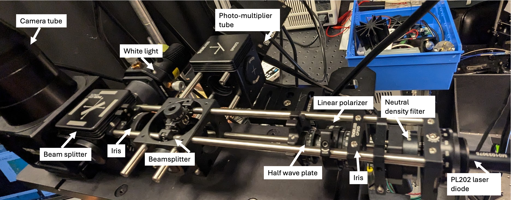

July 2-3rd, 2024

SPCM updates

## **Alignment improvements**

- The linear polarizer (LP) is set to maximize power out of the PL202
- Both the LP and HWL mounts are checked for good fit, no tilting
- One iris moved to the end of the optical path before the beamsplitter (BS3) between the obj. and camera
- I can remove the BS3 and add cage rails to check the alignemnt further way
- I can remove the black plastic bellows between the top of the microscope body and the top of the objective to ensure that the beam is centered there
    - I ordered a alignment tool that will screw into the top of the objective so that I can check alignment there in the future more precisely

## **Beamsplitter compensation**

- I realized that the first beamsplitter (BS1) which attached the photodetector to the system applies a displacement to the beam whihc causes misalignment downstream
-  
- for this you can use a compensation plate such as the  
    [BCP4310](https://www.thorlabs.com/newgrouppage9.cfm?objectgroup_id=10662&pn=BCP4310)  *I ordered this.*  
    

## **Current optical path**

## **Quick reflection map test**
Now that the alingment is improved I want to see if I can get a reflectio map with a pretty large ND filter. Test is explained in image below. Used ND40A (aka 0.01% transmission)

