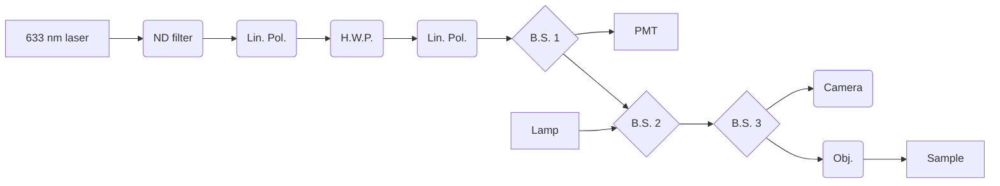
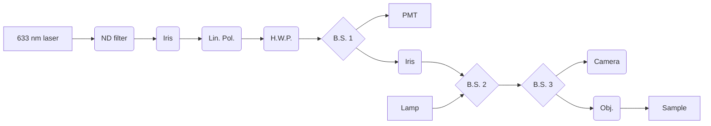

# SPCM Laboratory Notebook June 28, 2024:

## Setup
### Optical path:
I just added in linear polarizers before and after the HWP to determine polarization state:

### Optical path components:

| Item              | Part # | About |
| :---------------- | :------: | ----: |
| 633 nm laser      | PL202	| Compact Laser Module with USB Connector, 635 nm, 0.9 mW (Typ.)  |
| ND filter, 0.01\% |   NE40A   | Neutral density filter |
| Lin. Polarizer    | LPVISE050-A | Linear polarizer, 38 \% unpol Transmission |
| 1/2 Waveplate    | WPH05ME-633 | Linear polarizer, -- \% Reflection |
| 1/2 Waveplate    | LPVISE050-A | Linear polarizer, 38 \% unpol Transmission |
| Beamsplitter 1  | ...   | Splits optical path to PMT |
| PMT |  PMTSS   | Standard Sensitivity PMT Module|
| Lamp  |  MWUVL1   | Neutral white LED |
| Beamsplitter 2  |  ...   | Adds in white lamp for imaging|
| Beamsplitter 3  |  ...  | Splits between camera and objective |
| Camera tube    |  WFA4102   | Camera port 0.5x |
| Camera    |  8051C-USB   | 8 MP Color CCD Camera |
| Objective |  LMM40X-P01   | 40X Reflective Objective P01 Coating 0.50 NA BFL = Infinity |

BSW04 - Ø1/2" 50:50 UVFS Plate Beamsplitter, 400-700nm, t=3mm
BSW29P - 50:50 UCFS plate beamsplitter 600-1700nm
BSS10R - 25 x 36 mm 30:70 (R:T) UVFS Plate Beamsplitter, Coating: 400 - 700 nm, t = 1 mm
BSX10 - 90:10 (R:T) UVFS Plate Beamsplitter, Coating: 400-700 nm, t = 5 mm

## State of the SPCM setup

I have a higher fidelity Faraday cage which I can screw into the SPCM MLS302 stage and importantly the SMA wire is also sheidled and attached the SMA on the PCB.
This has gotten rid of the EMI patterns and how I get ~30-40 nm noise that is mostly uniform across a spatial measurement.

Some to dos:

- edit Brady's board so that the mezzanines can be closer together (OR for now just mount the middle m2 connector and just use that)
- get better set screws for the mezzanine boards -- **ordered**
- prep the Bi2Te3 and TaIrTe4 samples -- in 5th floor of nano
- feel confident about polarization sweep
- talk to nanolab about why my basic fab keeps coming out really badly for the PPMS substrates

## Status of Samples

The PbTaSe2 from 2DSemiconductor.com, deposited on HS39626-WO: SSP w/2 Semi-Std Flats & 2850 A°±5% Wet Thermal Oxide. Electrodes fabricated around flakes in the MIT Nano lab May 23, 2023 by Morgan Blevins. PPMS measurements performed on the "orange" flake by Thanh Ngyu
This flake has falled off of the substrate. I don't know how it fell off but I think I needed to be more carefull of how I stored it between measurements, I think it was possibly blown off due to the AC in the lab or it was bumped and I didn't realize. 

# July 1st update

**UPDATES**
- Soldered on a new M.2 connector so I have a good mainboard PCB wb 
- Have a better screw connector to the mezzanine bpard
- Bi2Te3 and PbTaSe2 samples are wirebonded and ready to test, TaIrTe4 couldn't wirebond
- I made big improvements to alignment: had to better align the beam between the WFA2400 and the objective. Also need to have a lin. polarizer infront on the laser diode followed by the half-wave plate. And I now have an iris right in fron of the laser and then right before the WFA. I also removed the insert from the WFA2400 and added cage rails to test alignment way further out and this is what reallly improve the alignment down to the objective.
- Now the biggest issue is just the beam size of the PL202 as compared to the entry on the objective, I think I need to finally hook up the HeNe. Will need to decide how to attenuate the power (either get a [new laser](https://www.thorlabs.com/thorproduct.cfm?partnumber=HNLS008L#ad-image-0) or buy a [fiber attenuation kit](https://www.thorlabs.com/newgrouppage9.cfm?objectgroup_id=6162) ( about the same price...).
- If I turned it slowly, I got to the point when rotating the HWP did NOT seem to move the beam spot, which is a sign of alignment. 
- I think I can go forward with testing the Bi2Te3 sample tomorrow, I may not trust the coninuity of power as I sweep polarization but I can get a qualitative picture.
- The power meter is pretty annoying-- either the power of the PL202 is super jumpy or the meter is off. I'm gonna ask Mathias if he has a meter I could briefly borrow.

Current path:

