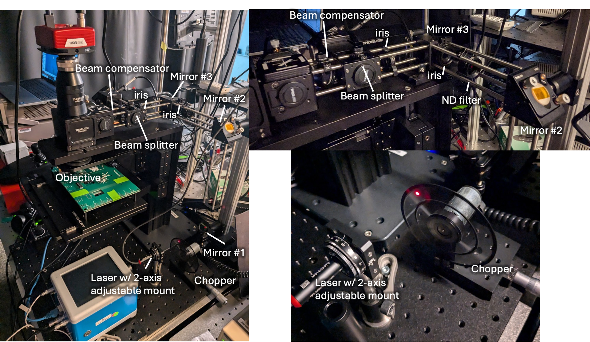
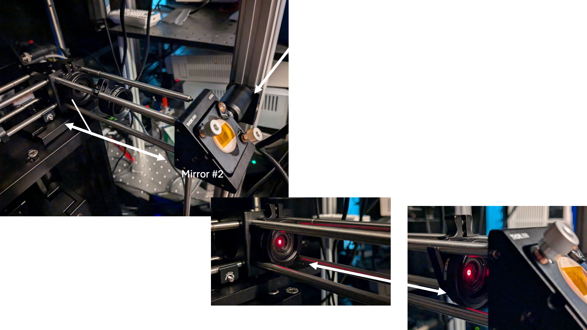
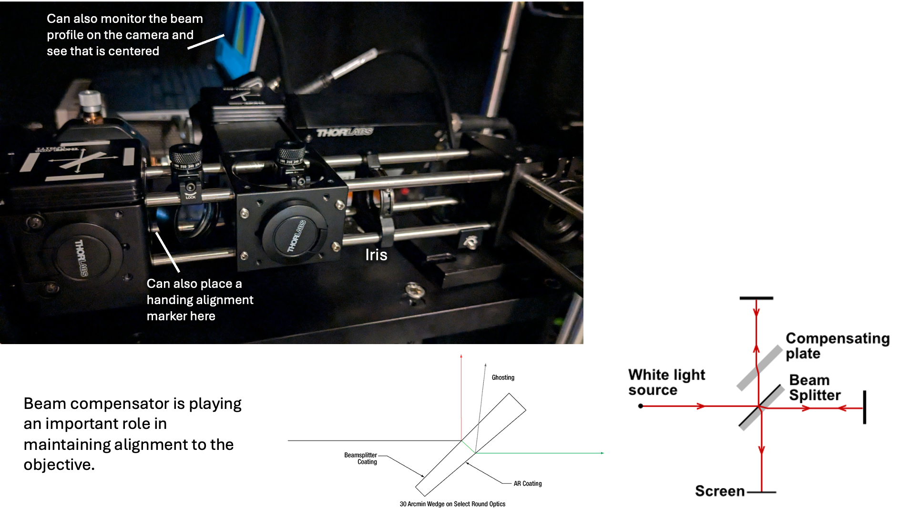
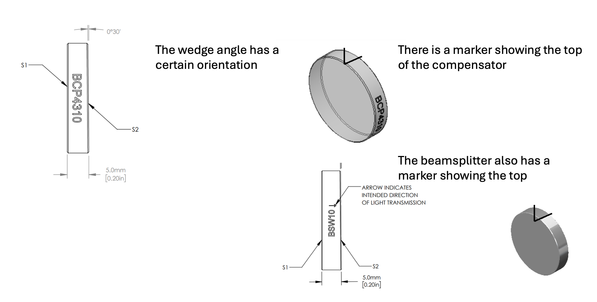
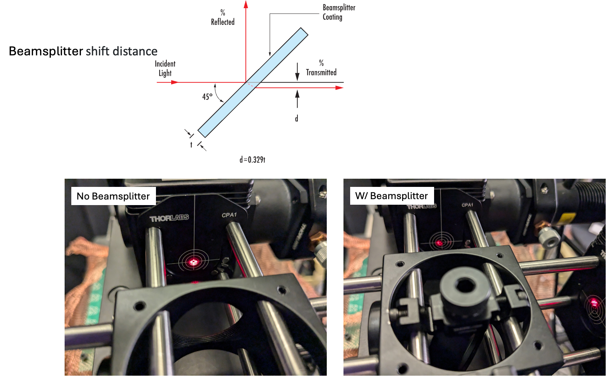
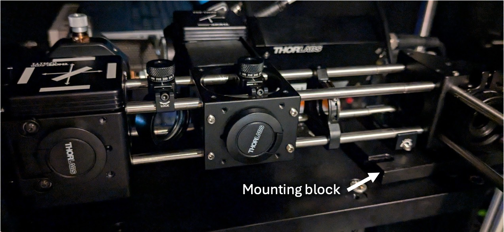

**August 30th, 2024**

This outlines the alignment procedure for the 633 nm laser diode in the Boriskina Lab SPCM as of August 2024. This procedure has so far given the best reflection mapping results.

**Current SPCM setup:**

****

**Step 1:** Adjust mirror #1 and #2 (or #1 and the laser holder) back and forth until the laser is aligned all along the cage section when the iris is moved back and forth

Note: I had to be pretty careful about how I locked down the mirror #2 to the vertical post. If its too high or low it bends the posts and make the system un-level.

****

**Step 2:** Adjust mirror #3 until the laser is centered in the iris

****

**NOTE:** Beam compensation must be properly aligned to the optical path and the beamsplitter

Below shows how the addition of the beamsplitter translates the beam without a compensator:

****

**NOTE:** I’ve used a mounting base to tilt up the cage so it’s level.

- I used the level app on my phone
- In the future this should be done more exactly/precisely- should consult Thorlabs for best practice on this.

