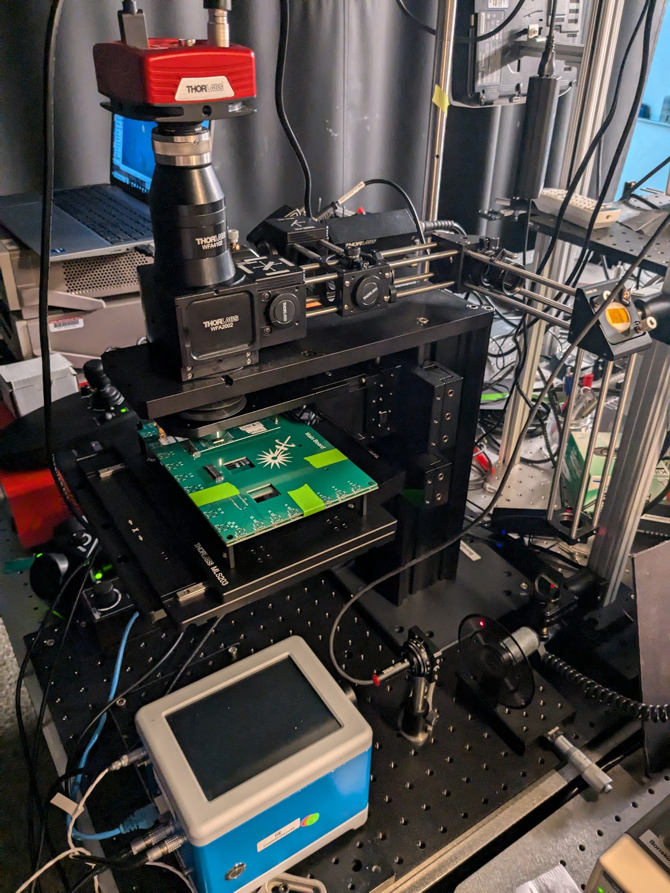
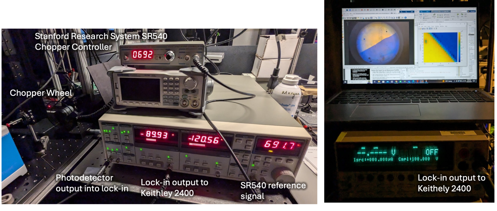
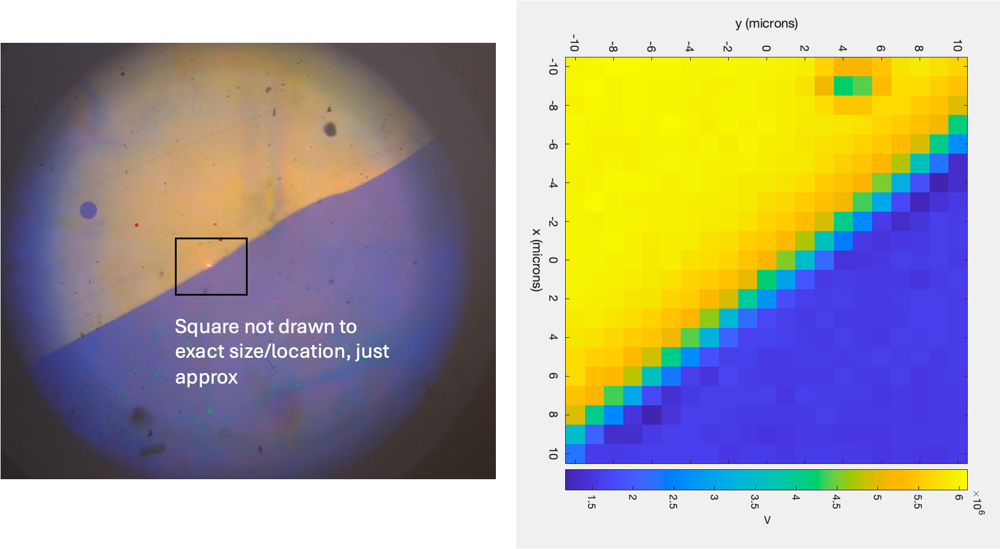

**August 29th, 2024**

Note, I followed the alignment procedure in the “alignment procedure” document. Very important to have alignment of the beamsplitter, compensator, and the objective and PMT.

**Procedure:**

1.  1Position the chopper wheel in front of the laser such that the laser hits the outer slots
2.  Connect the SR540 ‘f’ output to the the reference input of the SR830 Lock-in amp
3.  Turn on the SR540 and set to desired frequency (avoid 60 Hz and its harmonics)
4.  The SR830 lock in should immediately pick up the reference frequency and track is very easily
5.  Connect the photodetector output to the SR830 input A and select current measurement
6.  Set SR830 Channel 1 to display X or R (I did X in this test)
7.  Set SR830 Channel 2 to display phase (theta)
8.  Adjust setting of SR830 until Channel 2 phase is constant (follow 2f rule, etc)
9.  Connect the Channel 1 output to the Keithley 2400 and perform a scanning map over a gold-silicon interface on a wafer

This is the best reflection map I’ve ever gotten!! The gradation is really nice and exact. And it seems to even pick up a little hole in the upper right side.

Note,

- The PMT gets saturated depending on the gain you use to power it, so it may show “overload” if the conditions are too bright in the room. Reduce gain or lower lighting
- There is an extra 635 bandpass filter in Mathias’ cupboard- may add this in front of the PMT to get rid of this issue.
- In this test I used a 30ND filter and had 1 small over-the-optical-bench light on