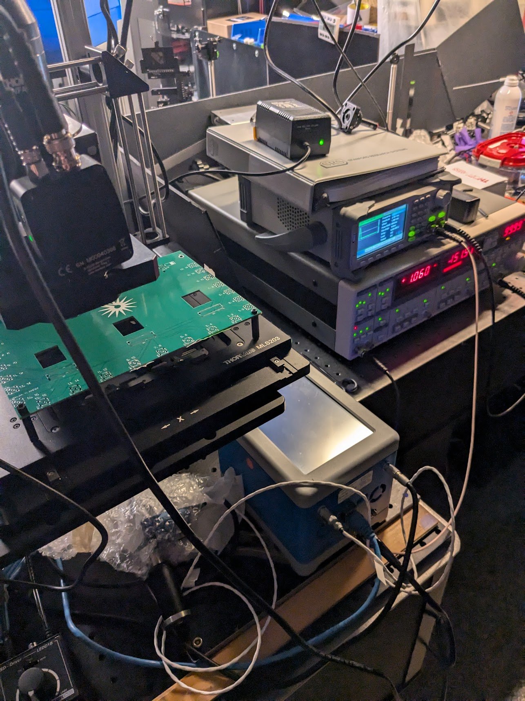
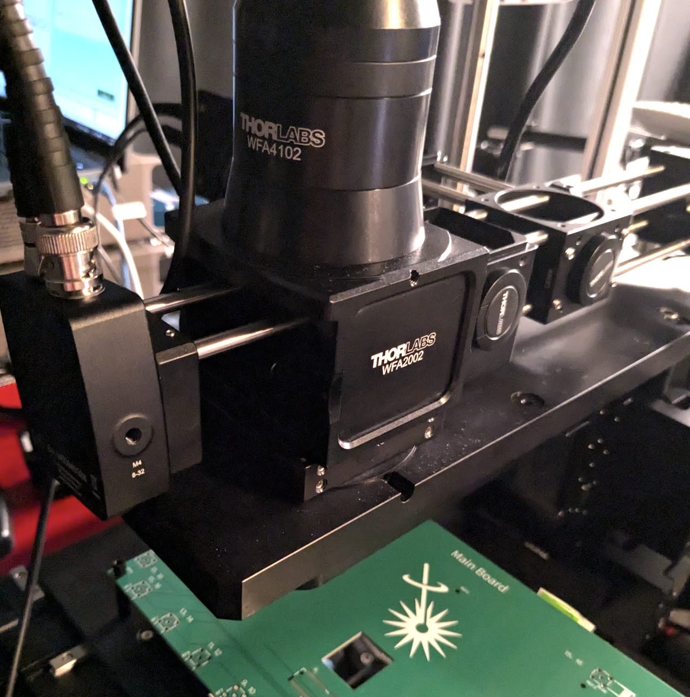

**August 20th (ish), 2024**

- **QCL** is integrated into SPCM and being triggered by a function generator which is also triggering the lock-in ampliflier
- The optical path is quick to align using the red guiding laser and the 3 adjustable mirrors
- HOWEVER, alignment with the beamsplitter (enabling reflection mapping is currently not done. I believe we need to compensate for the translation of the beam (like we do for the 633nm laser diode) but this is now much harder when you can't see the beam!!

Setup:

Í

Confirming that the QCL is aligned using the MCT at the WFA2002, reading detector output with the lock-in:

