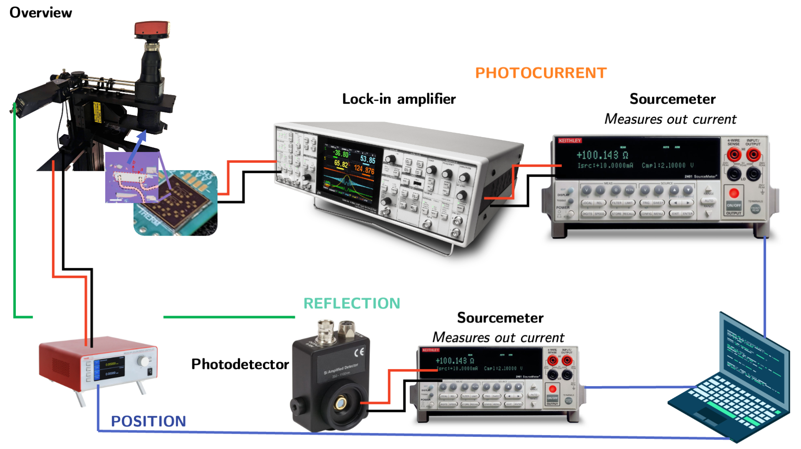
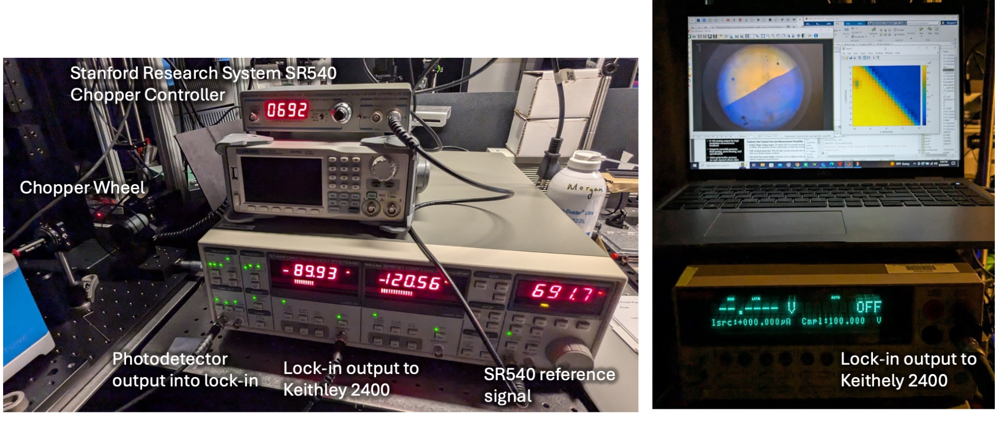

# Overview of systems

The SPCM takes simultaneous photocurrent and reflection maps 

# Optics

## Optical path from lasers to samples

## Polarization optics for 633 nm laser diode

### Creating linearly polarized 633 nm laser diode

### Creating circularly polarized 633 nm laser diode

Two linear polarizers are used before and after the QWP along with a power meter. I kept the first LP static, so it still maximizes the power out of the PL202 laser. Then, without the QWP in the system, I crossed the two polarizers so that no power reached the power meter. Then I added the QWP between them and rotated it until I maximized power to the power meter. This occurs when the fast axis of the QWP is 45 degrees rotated from the input linearly polarized light. Thus, when I remove the second LP, I have circularly polarized light (illustrated in the Edmund optics diagram below).

# Electronics

## PCB for interfacing silicon die samples

Designed by Brady and Jacqueline

## Measuring current from photodetectors/PCBs

See "Optical chopper for 633 nm..." document for procedure

## Triggering QCL

Follow procedure in “QCL with func gen and lock in amplifier.pptx”