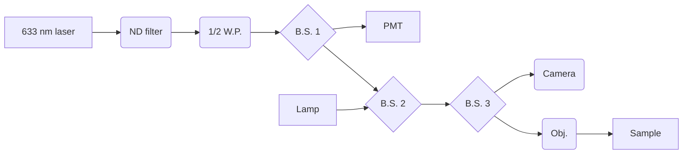

## Scanning Photocurrent Microscope Laboratory Notebook
### May 20, 2024: Possible electromagnetic inferference on PbTaSe2 photocurrent measurement
This lab notebook documents my setup and measurements for measuring spontaneous photocurrents in single crystal samples that are prepared in the nanofab. The principle and goal of this experiment is presented in the following papers:

1. [Ma, J., Gu, Q., Liu, Y. et al. Nonlinear photoresponse of type-II Weyl semimetals. Nat. Mater. 18, 476–481 (2019). https://doi.org/10.1038/s41563-019-0296-5]([url](https://doi.org/10.1038/s41563-019-0296-5))
2. [Jiang, J., Chen, Z., Hu, Y. et al. Flexo-photovoltaic effect in MoS2. Nat. Nanotechnol. 16, 894–901 (2021). https://doi.org/10.1038/s41565-021-00919-y]([url](https://doi.org/10.1038/s41565-021-00919-y))

### Experimental principle/examples

- Spatially local photoinduced current (local photocurrent) 
- Generated in a tight laser beam spot 
- Sensed far away at remote current-collecting–voltage-sensing contact
- Depending on laser power, the magnitude of current can be in the nanoAmp to microAmp range

<figure>
    
</figure>

*Scanning photocurrent principle and the goal result of a SPCM measurement: a spatial map of photocurrent.*

 

### Optical path:

### Optical components:

| Item              | Part # | About |
| :---------------- | :------: | ----: |
| 633 nm laser      | PL202	| Compact Laser Module with USB Connector, 635 nm, 0.9 mW (Typ.)  |
| ND filter, 0.01\% |   NE40A   | Neutral density filter |
| 1/2 Waveplate    | WPH05ME-633 | Linear polarizer, -- \% Reflection |
| Beamsplitter 1  | ...   | Splits optical path to PMT |
| PMT |  PMTSS   | Standard Sensitivity PMT Module|
| lamp  |  ...   | White lamp |
| Beamsplitter 2  |  ...   | Adds in white lamp |
| Beamsplitter 3  |  ...  | Splits between camera and objective |
| Camera tube    |  WFA4102   | Camera port 0.5x |
| Camera    |  8051C-USB   | 8 MP Color CCD Camera |
| Objective |  LMM40X-P01   | 40X Reflective Objective P01 Coating 0.50 NA BFL = Infinity |

## Sample

PbTaSe2 from 2DSemiconductor.com, deposited on HS39626-WO: SSP w/2 Semi-Std Flats & 2850 A°±5% Wet Thermal Oxide. Electrodes fabricated around flakes in the MIT Nano lab May 23, 2023 by Morgan Blevins.

Starting with the "blue" flake on the PbTaSe2 chip 4, which is wirebonded to electrodes 4,5, 20, 21, and 22. First I do a quick **reflection** map of the entire flake to confirm that the setup is working in reflection mode:

Mounted on the final PCB setup:

## Attempt to measure photocurrent: Electromagnetic Inference

Last week I realized there was some stray signal coming from the X-Y MLS203 stage interferring with the current measurement from the board. This gave huge (hundreds of nanoAmps) currents that would spike out the measurement and make it uninterprittable. With some trial and error I found that (1) slowing the motors down to super low velocites and (2) raising the board several inches above the stage combined seem to get rid of this signal.

Using: 
velParams.Acceleration = 100;
velParams.MaxVelocity = 100;

Here is an updated picture of the setup (current two PCBs stacked since I have to soldier a new m.2 connector on the verion2 mainboards (version 1 was too small):

First ever attempt with the board suspended, using the laser and illuminating the PbTaSe2_052323-4 chip. Actually looks like I'm getting a signal, but I'm going to now modify the code to measure reflection simultaneously. 

I don't intially recognize this shape, it does kind of appear to be the flake and electrode interface BUT I believe it is actually EMI. I will next run a measurement over the same area but with no laser on to get a control.

Current measurement when the flake is **NOT illuminated**. The expected map would just show constant noise, so it should just be a uniform color:

Uh oh, so I see a sort of **statified current measurement** coming through in the same way, when I *should* just see noise/a uniform measurement. This is evidence than an EMI signal is coming from the MLS203. You see the same magnitude of EMI at the same y-position, creating a sort of field pattern perhaps. The x-poistion doesn't seem to have a pattern of EMI. I just put my hand in between the board and stage and saw the signal dip. Gonna go get the EMI shielding from Thorlabs. The lines in the plots above that aren't with the trend are when I tried to place the EMI shield/ put my hand in front.

Notes on trying to mitigate EMI:

- EMI sheilding from ThorLabs does not seem to help at all (at least the 1 layer I used). My hand is more effective.
- Distance from stage makes it better
- The PCB doesn't need to be touching the MLS203 for this interference to happen
- When MLS203 is OFF I see no interference. 
- Reconfirmed that distance between board and stage is really helping -- signal goes WAY up when they are close, despite low velocity.
- Recall that I even picked up bad signals when measuring a resister as it was moved on the stage, so it does not seem to be an issue with my PbTaSe2 sample.

